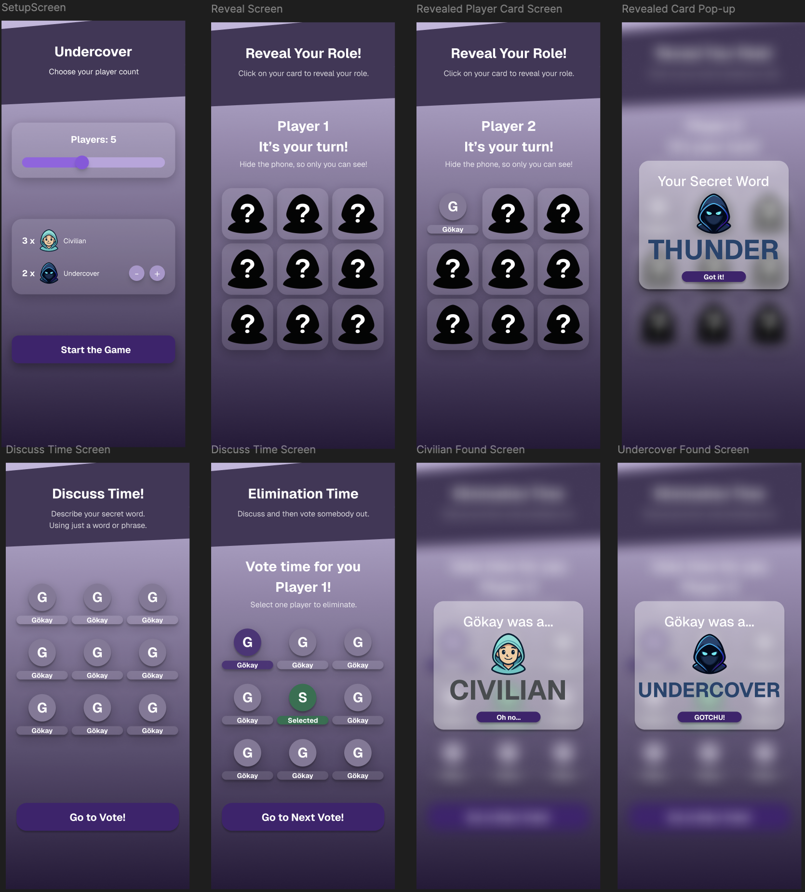

# Undercover Game - Dancecovery Task

An offline version(or local) adaptation of the popular party game "Undercover" developed as a tech stack for Dancecovery.

# Design

## How to Run

1. **Prerequisites**: Ensure you have Flutter installed on your machine.
2. **Get Dependencies**: Run `flutter pub get` in the project root.
3. **Run the App**: Run `flutter run` to start the application on your connected device or emulator.

## App Structures

- **`lib/models/`**: Contains data models like `Player` and `WordPair`.
- **`lib/providers/`**: Manages application state using the `provider` package (e.g., `GameProvider`).
- **`lib/screens/`**: Contains the different screens of the game flow:
  - `SetupScreen`: Game configuration.
  - `RoleRevealScreen`: Shows players their secret words.
  - `DiscussionScreen`: Timer for player discussion.
  - `VotingScreen`: Players vote to eliminate someone.
  - `RoundResultScreen`: Shows the result of the voting.
  - `GameOverScreen`: Displays the winner.
- **`lib/utils/`**: Utility classes and static game data.
- **`lib/widgets/`**: Reusable UI components like `GameLayout`, `GlassButton`, `PlayerGridItem`.
- **`lib/main.dart`**: The entry point of the application.